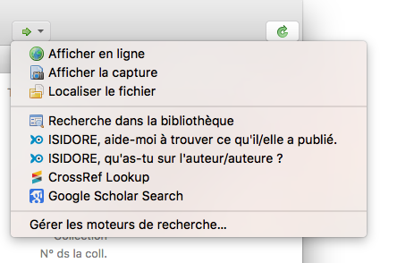

# Connecteurs ISIDORE pour Zotero

(for english version above)

## Enrichir sa bibliothèque Zotero avec ISIDORE

L'outil Zotero permet d'utiliser des moteurs de recherche pour rechercher ou completer des références bibliographiques. Nous proposons ici deux connecteurs ISIDORE pour Zotero permettant d'utiliser ISIDORE pour completer sa bibliothèque de références bibliographiques à partir de recherche sur les auteurs.

### Fonctions

L'ajout d'ISIDORE à Zotero permet :

- De compléter des références à partir d'une recherche sur le nom de l'auteur ou de l'auteure : c'est le «ISIDORE, aide-moi à trouver ce qu'il/elle a publié.»
- De trouver des documents dans lequel l'auteure ou l'auteur est cité : c'est le «ISIDORE, qu'as-tu sur l'auteur/auteure ?»

### Fonctionnement

En sélectionnant une référence dans Zotero, il suffit d'ouvrir avec la flèche verte située à droite du champ de recherche des références :

Puis de sélectionner les liens "ISIDORE, ..." de votre choix :

Une fenêtre de votre navigateur s'ouvre alors avec la réponses proposées par ISIDORE.

### Installation :

Fermez votre Zotero, Ouvrir le fichier <Zotero>/locate/engines.json (ex. sous Mac : Users/utilisateur/Zotero/locate) dans un éditeur de texte (Atom, TextEdit, etc.) et ajoutez juste après le premier [ le code json suivant :

`{
  "name": "ISIDORE, aide-moi à trouver ce qu'il/elle a publié.",
  "alias": "ISIDORE",
  "icon": "https://www.rechercheisidore.fr/favicon.ico",
  "_urlTemplate": "https://www.rechercheisidore.fr/search/?creator={rft:aulast?}+{rft:aufirst?}",
  "description": "ISIDORE is an academic search engine for arts and humanities in open science.",
  "hidden": false,
  "_urlParams": [],
  "_urlNamespaces": {
    "rft": "info:ofi/fmt:kev:mtx:journal",
    "z": "http://www.zotero.org/namespaces/openSearch#",
    "": "http://a9.com/-/spec/opensearch/1.1/"
  },
  "_iconSourceURI": "https://www.rechercheisidore.fr/favicon.ico"
},
{
  "name": "ISIDORE, qu'as-tu sur l'auteur/auteure ?",
  "alias": "ISIDORE",
  "icon": "https://www.rechercheisidore.fr/favicon.ico",
  "_urlTemplate": "https://www.rechercheisidore.fr/search/?q=\"{rft:aufirst?}+{rft:aulast?}\"",
  "description": "ISIDORE is an academic search engine for arts and humanities in open science.",
  "hidden": false,
  "_urlParams": [],
  "_urlNamespaces": {
    "rft": "info:ofi/fmt:kev:mtx:journal",
    "z": "http://www.zotero.org/namespaces/openSearch#",
    "": "http://a9.com/-/spec/opensearch/1.1/"
  },
  "_iconSourceURI": "https://www.rechercheisidore.fr/favicon.ico"
},`

### English version

Connectors are available for english people, please use engines_en.json :

`{
  "name": "ISIDORE, help me find what this author has published.",
  "alias": "ISIDORE",
  "icon": "https://www.rechercheisidore.fr/favicon.ico",
  "_urlTemplate": "https://www.rechercheisidore.fr/search/?creator={rft:aulast?}+{rft:aufirst?}",
  "description": "ISIDORE is an academic search engine for arts and humanities in open science.",
  "hidden": false,
  "_urlParams": [],
  "_urlNamespaces": {
    "rft": "info:ofi/fmt:kev:mtx:journal",
    "z": "http://www.zotero.org/namespaces/openSearch#",
    "": "http://a9.com/-/spec/opensearch/1.1/"
  },
  "_iconSourceURI": "https://www.rechercheisidore.fr/favicon.ico"
},
{
  "name": "ISIDORE, what do you have about this author?",
  "alias": "ISIDORE",
  "icon": "https://www.rechercheisidore.fr/favicon.ico",
  "_urlTemplate": "https://www.rechercheisidore.fr/search/?q=\"{rft:aufirst?}+{rft:aulast?}\"",
  "description": "ISIDORE is an academic search engine for arts and humanities in open science.",
  "hidden": false,
  "_urlParams": [],
  "_urlNamespaces": {
    "rft": "info:ofi/fmt:kev:mtx:journal",
    "z": "http://www.zotero.org/namespaces/openSearch#",
    "": "http://a9.com/-/spec/opensearch/1.1/"
  },
  "_iconSourceURI": "https://www.rechercheisidore.fr/favicon.ico"
},`  

## Crédits

Auteur : Stéphane Pouyllau -
Remerciements : Caroline Muller (pour les tests), Sean Takats, Laurent Capelli, Adrien Desseigne, Elifsu Sabuncu.
